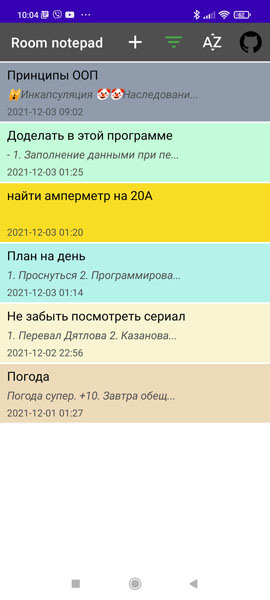
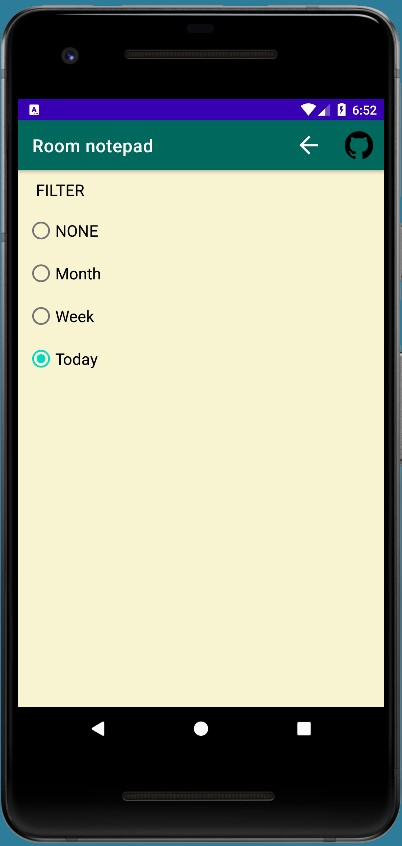
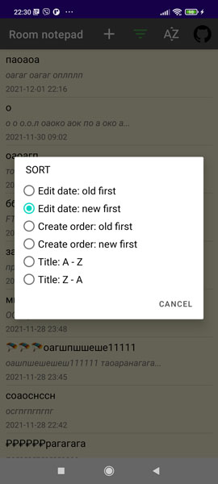

Room notepad

Development program https://github.com/AlexeyPertsukh/hw40-android-databasehelper-easy-notepad, 
but using Room

----
Lesson theme:
- SQLite, Room

Features of the program code:
- Single activity
- Working with SQL via Room
- RecyclerView
- Items sorting and filtering
- Change the color of the menu item icon when setting the filter
- Keep text cursor position or selected text on rotation 

[28.11.21]